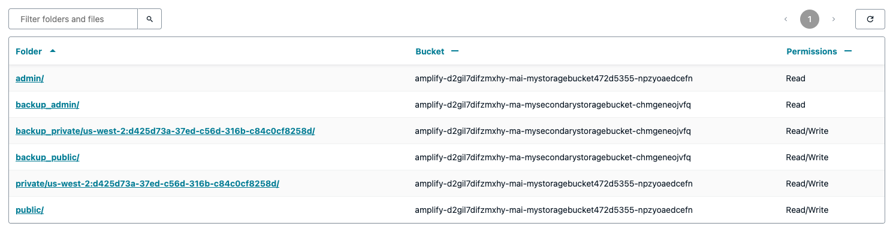
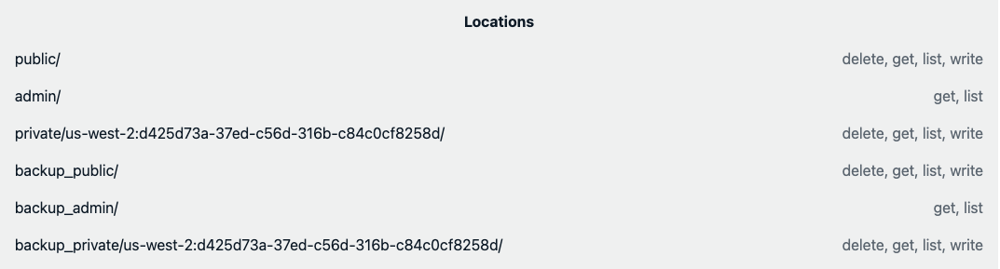

# Getting to know the S3 storage browser

Amplify storage brings robust file handling features to both web and mobile applications by leveraging Amazon S3 under the hood. With easy-to-use APIs and pre-made UI elements, developers can create secure and scalable file storage experiences without needing to dive deep into the complexities of cloud infrastructure.

## What is the S3 storage browser

The storage browser is a UI component available through the Amplify UI library. This out-of-the-box interface allows users to upload, view, and manage files stored in your S3 bucket. In the following sections, we’ll walk through how to set it up, tailor it to your needs, and even create a custom interface from scratch if desired.

## Setting up the storage browser

The quickest way to set up the storage browser is to use the [amplify storage browser template](https://github.com/aws-samples/sample-amplify-storage-browser) which creates S3 buckets for you. If you rather work with an existing bucket(s), there is also a [template](https://github.com/aws-samples/sample-amplify-storage-browser/tree/sample/amplify-auth-with-existing-bucket) that does exactly that. In the scope of this guide we will use the first [template](https://github.com/aws-samples/sample-amplify-storage-browser) that creates S3 buckets for us.
To deploy this template, an AWS account with appropriate permissions is required.

### Steps to deploy

1. **Navigate to the Amplify console**  
   Access the Amplify application in AWS, then follow [this very short video guide](https://docs.amplify.aws/images/gen2/getting-started/react/deploy.mp4) to deploy the template. The process includes configuring the backend and hosting for your app.

2. **Obtain the deployment URL**  
   Once deployment completes, the URL to our new app can be found in the Amplify console. Open this link to view your storage browser app.

3. **Create an account and sign in**  
   The template comes with authentication features out-of-the-box, making the storage browser secure by default. If you want, you can customize sign-up/in requirements for your specific needs (for example, only allowing certain users or even disabling authentication altogether).

4. **Explore the storage browser**  
   Upon signing in, you will see three buckets with three folders each, as configured in the sample template. This offers a familiar file-system-like interface for your users.
   - [This configuration](https://github.com/aws-samples/sample-amplify-storage-browser/blob/main/amplify/storage/resource.ts) sets up the buckets' folders and their permissions. For more on bucket authorization rules, check the [official Amplify docs](https://docs.amplify.aws/react/build-a-backend/storage/authorization/).



> **And that's it!** With this setup you get enterprise-ready file browsing interface running in just a few minutes!

## Customizing the S3 storage browser

There are multiple ways to customize the storage browser for better branding and user experience purposes:

1. The simplest one is to override the [amplify ui theme](https://ui.docs.amplify.aws/react/theming#theme-object).
   - In addition to overriding theme, plain CSS can be used to adapt the style of the components.
   - All the design tokens defined in the Amplify theme are CSS variables that can be overridden.
2. The storage browser is made of composable components which can be reordered and customized.
   - This can be achieved with the help of the [exposed hooks](https://ui.docs.amplify.aws/react/connected-components/storage/storage-browser#view-reference) that have access to the storage browser's internal state and event handlers.
   - (e.g., Hide the upload button for users that have only read access)
3. Custom-made storage browser from scratch if prebuilt components don't fit your requirements.
   - While the storage browser component is powerful, sometimes you need complete control over the UI/UX or require features not offered out of the box. In such cases, you can use the underlying [Amplify storage module directly](https://docs.amplify.aws/javascript/build-a-backend/storage/reference/).

### Plain CSS customization

A plain CSS file containing rules that target the Amplify static classes is powerful enough to satisfy many styling requirements. As an example,
we can change the title font and the table's border radius. In the [template](https://github.com/aws-samples/sample-amplify-storage-browser) in `App.css` add the following CSS code:

```css
.amplify-storage-browser__data-table {
  border-radius: 2rem;
}

.amplify-storage-browser__title {
  font-weight: bold;
  font-family: monospace;
}
```

Execute `npm run dev` and you are ready for local development. Through the Chrome dev tools discover the classes that you seek and adapt them to your liking.

> **! Beware** that plain CSS styles are global and will target multiple instances of the component!

### Taking advantage of the composable components

What if you didn't need a full-blown table but only a simple listing of the S3 buckets. This can easily be achieved by using the hooks exposed from the storage browser component:

```javascript
function LocationsView() {
  const state = useView('Locations');

  return (
    <Flex direction="column" padding="medium">
      <Text fontWeight="bold">Locations</Text>
      {state.pageItems.map((location) => {
        return (
          <Flex key={location.id} textAlign="start">
            <Text flex="1">{location.prefix}</Text>
            <Text color="font.tertiary" fontWeight="normal">
              {location.permissions.join(', ')}
            </Text>
          </Flex>
        );
      })}
    </Flex>
  );
}
```

By using `useView('Locations')` we can get access to the internal state of the storage browser. Besides the locations view, you can also [customize](https://ui.docs.amplify.aws/react/connected-components/storage/storage-browser#custom-ui) the location detail, upload, copy, create, and the delete view.



### Without the Amplify UI library

Maybe you already are using some kind of component library, and you just don't want to add another dependency. In that case building something from scratch is a valid approach. Let's just say we want to retrieve the list of files in a bucket folder and display it.
The Amplify storage module offers these [API endpoints](https://docs.amplify.aws/javascript/build-a-backend/storage/reference/). In this case we need just the list endpoint.

```javascript
function LocationsViewCustom() {
  const [locations, setLocations] = useState([]);

  useEffect(() => {
    list({
      path: 'public/',
      options: {
        bucket: 'myStorageBucket',
      },
    }).then((res) => {
      setLocations(res.items);
    });
  }, []);

  return (
    <Flex direction="column" padding="medium">
      <Text fontWeight="bold" alignSelf="start">
        Locations
      </Text>
      {locations.map((location) => {
        return (
          <Flex key={location.id} textAlign="start">
            <Text flex="1">{location.path}</Text>
          </Flex>
        );
      })}
    </Flex>
  );
}
```

Here we are listing the `public` folder of the bucket named `myStorageBucket`.

> **! Make sure** you have the Amplify library installed! To do so run `npm install aws-amplify.`

## Conclusion

Amplify’s S3 storage browser makes it easy to add secure, scalable file management to your app in minutes. With built-in authentication and flexible customization options, ranging from theming to advanced UI hooks, you can tailor the experience to your needs. For more control, you can use Amplify’s storage APIs directly to build custom solutions. Whether you use the prebuilt components or go fully custom, Amplify simplifies cloud file storage browsing so you can focus on building great features for your users.
